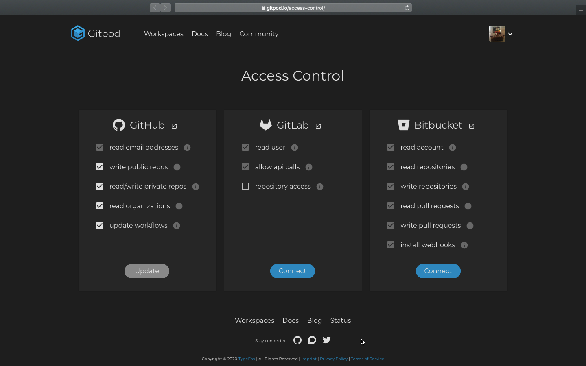

# ARC 2020.1

Ambiente de prototipação com [Gitpod](https://gitpod.io).

## Passo zero: ler (e escutar) o livro/jogo/apostila da disciplina

A documentação completa está em https://arc20201.boidacarapreta.cc.

## Passo um: bifurcar este repositório

Para poder realizar todas as ações solicitadas, e registrá-las devidamente no controle de versão, é preciso bifurcar este repositório para criar um repositório particular - preferencialmente público para facilitar a integração com o Gitpod. Assim, o Gitpod conseguirá gravar no repositório, uma vez que será próprio de cada aluno.

A documentação do próprio GitHub de como bifurcar o repositório está em: https://docs.github.com/pt/github/getting-started-with-github/fork-a-repo.

## Passo dois: antes de criar o Gitpod

Antes de criar o Gitpod, é preciso criar as seguintes [variáveis de ambiente no Gitpod](https://gitpod.io/settings/):

| Name               | Value             | Organization/Repository |
| ------------------ | ----------------- | ----------------------- |
| `INFLUXDB_BASEURL` | URL do servidor   | Nível de acesso         |
| `INFLUXDB_BUCKET`  | _Bucket_ criado   | Nível de acesso         |
| `INFLUXDB_ORG`     | Organização       | Nível de acesso         |
| `INFLUXDB_TOKEN`   | _Token_ de acesso | `*/*`                   |

Exemplo:

| Name               | Value                                             | Organization/Repository |
| ------------------ | ------------------------------------------------- | ----------------------- |
| `INFLUXDB_BASEURL` | `https://us-central1-1.gcp.cloud2.influxdata.com` | `*/*`                   |
| `INFLUXDB_BUCKET`  | `ideias`                                          | `*/*`                   |
| `INFLUXDB_ORG`     | `abc`                                             | `*/*`                   |
| `INFLUXDB_TOKEN`   | `codigosecreto`                                   | `*/*`                   |

Uma vez criadas as variáveis de ambiente, o Gitpod rodará o cliente em Python ou REST API com estes valores.

## Passo três: como rodar o Gitpod

Este repositório está preparado para rodar o código em modo depuração, com o objetivo de facilitar o desenvolvimento. Basta adicionar a URL deste respositório a `https://gitpod.io/#` para abrir no Gitpod.

Por exemplo, o repositório modelo `boidacarapreta/arc20201` fica assim: `https://gitpod.io/#https://github.com/boidacarapreta/arc20201` (com dois `https` mesmo).

## Passo quatro: autorizar o Gitpod a escrever no repositório

O Gitpod precisa de acesso de leitura e de escrita no repositório. Na página de controle de acesso ([https://gitpod.io/access-control](https://gitpod.io/access-control)), deve-se adicionar as seguintes permissões para o GitHub:

- `read email addresses` (já deve estar marcado)
- `write public repos` (este é essencial)

As demais permissões são opcionais. Na figura a seguir, uma sugestão de permissões:

Feito isto, pode-se usar a interface do Gitpod para criação de versão local (`git commit`) e sincronização com repositórios remotos como o próprio GitHub (`git pull` e `git push`).
